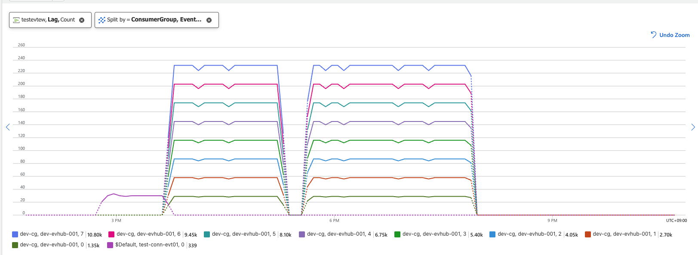

# eventhub-custom-metrics-emitter
Open Source: https://github.com/Azure-Samples/eventhub-custom-metrics-emitter
- Azure Container App으로 배포되는 오픈소스 애플리케이션
- EventHub 파티션과 Blob Storage에 저장된 Offset 정보를 수집해 EventHub Lag를 계산
- 계산된 EventHub Lag를 Azure Monitor Metrics로 전송


### 배포 절차
1. Parameter 세팅

    ```bash
    # param.json
    EventHubNamespace: 
    EventHubName:
    CheckpointAccountName:
    CheckpointContainerName:
    managedIdentityName:
    AcaEnvName:
    ```

2. 배포

    ```bash
    az deployment group create --resource-group <resource group name> --template-file main.bicep --parameters @param.json
    ```
3. 필요 권한 확인 (생성될 MI에 부여되야함)
    - Monitoring Metrics Publisher role for Azure Event Hub
    - Azure Event Hubs Data Owner role for Azure Event Hub
    - Storage Blob Data Reader for Azure Storage

### 배포 후 Azure Monitor 에서 메트릭 확인
- Azure EventHub > Monitor > Custom Metrics
