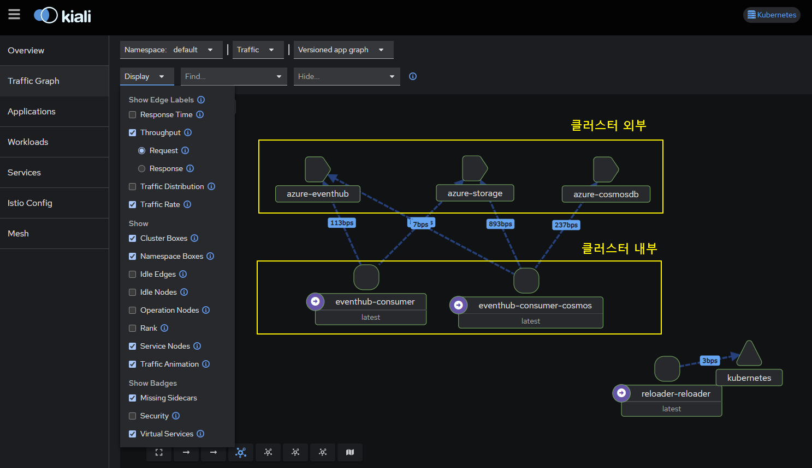

# Istio
- Istio 활용한 Eventhub Client Application Network Map 구현 목적 (Istio Minial Profile, Telemetry Object (for Eventhub))

## 테스트 결과 (제한사항)
- 클러스터 외부 리소스인 Eventhub,CosmosDB에 대한 시각화 제한으로 인해 철회
- Eventhub Entitiy는 EventhubNamespace/<Entity> 형태로 Path 기반 URL 로 표현해야 하지만, Istio를 사용하여 Eventhub의 TCP 트래픽 표현할 경우 Path 기반 Endpoint를 표현할 수 없음
- 즉, 1개의 Eventhub Namespace 내 각각의 Eventhub Entity를 표현할 수 없음
- CosmosDB 도 마찬가지로 데이터베이스 내부 컬렉션 별로 트래픽을 분류할 수 없음

  

## Installation Step

1. Install Istio by istioctl

- [Install istioctl](https://istio.io/latest/docs/ops/diagnostic-tools/istioctl/#install-hahahugoshortcode949s2hbhb)

  ```
  curl -sL https://istio.io/downloadIstioctl | sh -
  export PATH=$HOME/.istioctl/bin:$PATH
  ```

- [Install minimal profile](https://istio.io/latest/docs/setup/install/istioctl/#install-a-different-profile)

  `istioctl install --set profile=minimal`

2. Enable SideCar Injection (Namespace 단위)

`k label namespace default istio-injection=enabled`

3. Install Kiali dashboard (istio addon)

  `k apply -f ./kiali/kiali.yaml`


## Ref
## Install kiali operator
- manifest
- helm
```bash
helm install \
    --set cr.create=true \
    --set cr.namespace=istio-system \
    --set cr.spec.auth.strategy="anonymous" \
    --namespace kiali-operator \
    --create-namespace \
    kiali-operator \
    kiali/kiali-operator
```

## Integration with Prometheus Stack (Prometheus Operator)
for Istio
1. Configure ServiceMonitor for istiod
2. Configure PodMonitor for istio Proxy or envoy sidecar

for kiali
1. Edit Configuration Kiali (config.yaml)
    Edit: configmap or manifest file
    ```
    external_services:
      prometheus:
        url: http://prometheus-kube-prometheus-prometheus.monitoring.svc.cluster.local:9090
      grafana: 
        external_url: http://prometheus-grafana.monitoring.svc.cluster.local:80
        internal_url: http://prometheus-grafana.monitoring.svc.cluster.local:80
    ```